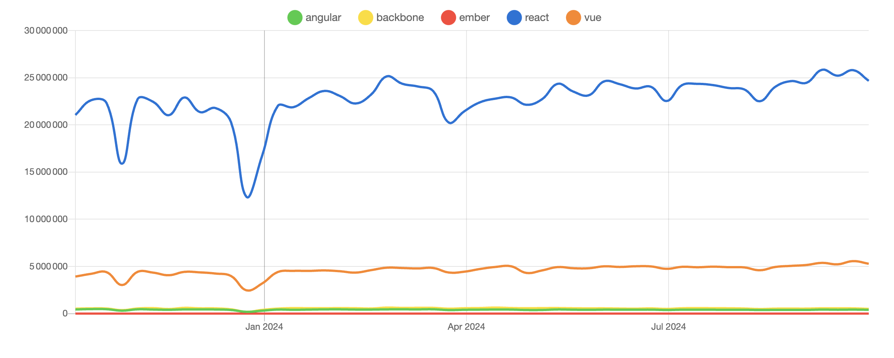

# 📚 Projet de Veille Technologique : **React**

## 👨‍💻 Contexte de l'exercice

Cet exercice est réalisé dans le cadre d'un cours de veille technologique en première année de master en développement fullstack. Le but est de mettre en place un projet de veille pour analyser les tendances actuelles autour d'une technologie spécifique

🔗 [Lien vers le sujet du TP](https://github.com/kevinniel/M1-MDS-2425-Veille)

## 👨‍💻 Justification du choix de la technologie

React, créé par Facebook, est un framework JavaScript populaire pour des interfaces utilisateur dynamiques et performantes.

- Résolution rapide des problèmes et nombreuses ressources d'apprentissage
- Écosystème Riche, Next.js, Gatsby, Redux, etc., pour des applications complètes et scalables
- Développement rapide et structure de projet améliorée
- Virtual DOM pour des mises à jour efficaces de l'interface
- Next.js améliore le référencement avec le rendu côté serveur
- Utilisé par Facebook, Airbnb, et Netflix
- Simplifie le développement et la maintenance avec une seule base de code
- Personnellement, j'utilise dans mon entreprise React avec Electron pour des applications desktop et PWA pour les clients

## 🔍 Comparatif des Frameworks JavaScript

Pour justifier le choix de React, voici un comparatif de l'utilisation des principaux frameworks JavaScript en 2023 :

L'image ci-dessus montre que React reste le choix préféré des développeurs en raison de sa flexibilité et de sa large adoption dans la communauté.

## Réseaux Sociaux

| Plateforme  | Lien                                                      | Justification                                                           |
| ----------- | --------------------------------------------------------- | ----------------------------------------------------------------------- |
| Twitter (X) | [React Twitter](https://twitter.com/reactjs)              | Compte officiel de React pour suivre les annonces et mises à jour.      |
| LinkedIn    | [React LinkedIn](https://www.linkedin.com/company/react/) | Réseau professionnel pour suivre les discussions et articles sur React. |

### Comptes à Suivre sur Twitter (X)

| Type                     | Compte                                                        | Justification                                                          |
| ------------------------ | ------------------------------------------------------------- | ---------------------------------------------------------------------- |
| Compte Officiel          | [React (@reactjs)](https://twitter.com/reactjs)               | Compte officiel de React pour les annonces et mises à jour.            |
| Créateur                 | [Jordan Walke (@jordwalke)](https://twitter.com/jordwalke)    | Créateur de React.                                                     |
| Développeurs             | [Dan Abramov (@dan_abramov)](https://twitter.com/dan_abramov) | Membre de l'équipe React chez Facebook.                                |
| Formateurs               | [Academind (@academind)](https://twitter.com/academind)       | Formateur en React et autres technologies web.                         |
| Développeurs Spécialisés | [Kent C. Dodds (@kentcdodds)](https://twitter.com/kentcdodds) | Développeur spécialisé en React et contributeur actif à la communauté. |

### Hashtags

| Hashtag     | Justification                                                             |
| ----------- | ------------------------------------------------------------------------- |
| #ReactJS    | Hashtag principal pour suivre les discussions et actualités sur React.    |
| #JavaScript | Pour suivre les tendances générales en JavaScript, souvent liées à React. |

### Communautés et Événements

| Communauté/Événement | Lien                                                 | Justification                                                         |
| -------------------- | ---------------------------------------------------- | --------------------------------------------------------------------- |
| Reactiflux           | [Reactiflux](https://www.reactiflux.com/)            | Communauté Discord pour discuter de React et obtenir de l'aide.       |
| React Conf           | [React Conf](https://conf.reactjs.org/)              | Conférence annuelle officielle de React.                              |
| Meetup React         | [Meetup React](https://www.meetup.com/topics/react/) | Groupes de meetup locaux pour rencontrer d'autres développeurs React. |

### Youtubeurs

| Chaîne         | Lien                                                     | Justification                                                     |
| -------------- | -------------------------------------------------------- | ----------------------------------------------------------------- |
| React          | [React YouTube](https://www.youtube.com/@React)          | Chaîne officielle de React pour les tutoriels et les conférences. |
| Traversy Media | [Traversy Media](https://www.youtube.com/@TraversyMedia) | Tutoriels et projets React pour les développeurs de tous niveaux. |
| Academind      | [Academind](https://www.youtube.com/@academind)          | Formations complètes sur React et autres technologies web.        |

### Agrégateurs de Flux RSS

| Outil    | Lien                                 | Justification                                                                   |
| -------- | ------------------------------------ | ------------------------------------------------------------------------------- |
| Feedly   | [Feedly](https://feedly.com)         | Permet de centraliser les flux RSS de différents sites et blogs orientés React. |
| Netvibes | [Netvibes](https://www.netvibes.com) | Offre une interface personnalisable pour suivre les actualités React.           |

## Outils et Sources Utilisés

### Sites Internet et Blogs

| Site/Blog     | Lien                                           | Justification                                                       |
| ------------- | ---------------------------------------------- | ------------------------------------------------------------------- |
| Site Officiel | [React Official](https://reactjs.org)          | Documentation officielle et ressources pour apprendre React.        |
| Medium        | [React Medium](https://medium.com/tag/reactjs) | Articles et tutoriels écrits par la communauté React.               |
| Dev.to        | [React Dev.to](https://dev.to/t/react)         | Plateforme de partage de connaissances pour les développeurs React. |

### Communautés et Forums

| Communauté     | Lien                                                                       | Justification                                                               |
| -------------- | -------------------------------------------------------------------------- | --------------------------------------------------------------------------- |
| Reddit         | [React Reddit](https://www.reddit.com/r/reactjs/)                          | Forum pour discuter des meilleures pratiques et des problèmes liés à React. |
| Stack Overflow | [React Stack Overflow](https://stackoverflow.com/questions/tagged/reactjs) | Plateforme pour poser des questions et obtenir des réponses sur React.      |

### Podcasts

| Podcast   | Lien                            | Justification                                                         |
| --------- | ------------------------------- | --------------------------------------------------------------------- |
| Syntax FM | [Syntax FM](https://syntax.fm/) | Podcast couvrant divers sujets de développement web, y compris React. |

### Google Alertes

| Alerte          | Justification                                                           |
| --------------- | ----------------------------------------------------------------------- |
| React News      | Alerte pour recevoir les dernières nouvelles et mises à jour sur React. |
| React Tutorials | Alerte pour découvrir de nouveaux tutoriels et ressources pédagogiques. |
